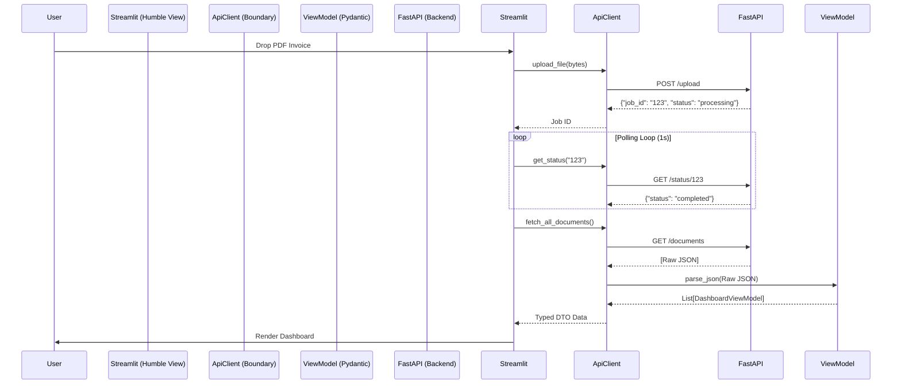

# 📄 PHASE 2 MASTER SPEC: Premium UI Architecture Blueprint

---

# 1. 🎯 EXECUTIVE SUMMARY & BUSINESS VALUE

## 1.1 Objective
The Business Document Intelligence System (BDIS) backend proves its value through rigorous Clean Architecture. However, backend processes are invisible to stakeholders. Phase 2 introduces a **Premium Visual Interface (UI)** built on the Streamlit framework. 

This UI acts as a high-end command center. It empowers non-technical risk analysts to securely ingest raw financial documents, visualize the automated AI parsing in real-time, and instantly triage financial risks.

## 1.2 Core Value Proposition
> Transform the invisible AI orchestration into a tangible, enterprise-grade experience. By visualizing instantaneous classification, the UI bridges the gap between deep-tech pipelines and actionable business insights.

---

# 2. 🧠 FRONT-END CLEAN ARCHITECTURE (HUMBLE OBJECT)

Streamlit is powerful but fundamentally flawed for enterprise scaling: it encourages mixing HTTP requests, state management, and HTML rendering into single files. To survive enterprise deployment, this UI rigidly enforces Uncle Bob’s **Humble Object Pattern**.

## 2.1 The Dependency Rule (UI as an External Detail)
The UI is at the absolute outermost layer of the system architecture.
1. **No Database Access:** The UI MUST NOT communicate with SQLite or Redis.
2. **Strict HTTP Tethers:** All communication flows exclusively through the FastAPI backend via secure REST.
3. **The Humble View:** `app.py` is "dumb." It contains zero business logic, zero network requests, and zero data transformations. It only accepts data objects and calls `st.write`.

## 2.2 Sequence Diagram: The Humble Object Lifecycle


---

# 3. 📂 COMPREHENSIVE REPOSITORY HIERARCHY

The phase 2 repository expansion requires strict separation of concerns, represented physically in the file tree:

```text
src/bdis/frameworks/ui/
├── __init__.py
├── app.py                   # Master routing and visual composition (The Humble View)
├── api_client.py            # HTTP Boundary: requests.get/post & Error Handling
├── view_models.py           # Pydantic DTOs: Maps JSON to front-end State Objects
├── state_manager.py         # Encapsulates st.session_state machine handling
├── css_tokens.py            # Hardcoded CSS injection strings for UI theming
└── components/              # Isolated, reusable Streamlit widgets
    ├── __init__.py
    ├── header.py            # Title and logo branding
    ├── uploader.py          # PDF drag-and-drop mechanics
    ├── metrics_card.py      # KPI visualizations
    └── risk_table.py        # Mapped interactive dataframes
```

---

# 4. 🧱 THE VIEW MODELS (UI DATA INTEGRITY)

The UI cannot trust the Backend API implicitly. If the backend changes a JSON key, a traditional Streamlit app will crash with a `KeyError`. We prevent this using Front-End View Models.

### 4.1 Strict Pydantic Contracts
The `ApiClient` receives raw JSON and passes it into `DashboardViewModel`:

```python
# view_models.py
from pydantic import BaseModel, Field
from typing import Optional

class DashboardViewModel(BaseModel):
    document_id: str
    company_name: str = Field(default="Unknown Entity")
    amount_usd: float = Field(default=0.0)
    status: str = Field(default="unknown")
    
    @property
    def is_high_risk(self) -> bool:
        """UI-Specific Business Logic (Derived State)"""
        return self.status.lower() == "unpaid" and self.amount_usd > 10000.0
```
*Note: Logic like `is_high_risk` belongs in the View Model. The humble view simply colors the row red if `model.is_high_risk == True`.*

---

# 5. 🔌 API CLIENT & NETWORK RESILIENCE

The `api_client.py` isolates the `requests` library. It acts as the blast shield between the UI and catastrophic network failures.

### 5.1 Graceful Network Degradation
If the FastAPI container is rebooting, `requests.get` will throw a `ConnectionError`. 

* **Rule:** The `ApiClient` MUST catch this error.
* **Rule:** It MUST return a safe fallback object (e.g., an empty list or an `ErrorViewModel`).
* **Rule:** The UI MUST dynamically sense the fallback object and render a clean, professional banner (`st.warning("Enterprise Backend is currently syncing. Please try again in 30 seconds.")`) rather than dumping a raw Python Traceback onto the stakeholder's screen.

### 5.2 12-Factor Protocol
Hardcoded URL hostnames (e.g., `http://localhost:8000`) are strictly forbidden. The `ApiClient` must read target hostnames from the OS Environment variables injected by Docker Compose.

---

# 6. ⚡ STATE MANAGEMENT & ANTI-DDOS ARCHITECTURE

Streamlit evaluates code from top to bottom every time a user interacts with the page.

### 6.1 The "Self-DDoS" Threat Vector
If `ApiClient.fetch_all_documents()` happens globally outside of a cache, clicking a column header on the Data Table will trigger a brand new HTTP request, resulting in database lockouts via self-inflicted Denial of Service.

### 6.2 Solution: Mandatory Caching Boundaries
All fetching mechanisms MUST be cached in memory:
```python
import streamlit as st

@st.cache_data(ttl=30, show_spinner=False)
def safe_fetch_dashboard_data():
    return api_client.fetch_all_documents()
```
This guarantees the API is hit a maximum of once every 30 seconds, regardless of how aggressively the user clicks the UI.

### 6.3 State Machine Flow
Complex state transitions during file upload (e.g., "Idle" -> "Uploading" -> "Polling" -> "Processing Complete") must be tracked explicitly inside `st.session_state` to prevent the UI from flickering back to the upload screen prematurely.

---

# 7. 🛡️ BROWSER-LEVEL SECURITY BOUNDARIES

The UI acts as the first line of defense against malicious actors attempting to poison the core backend extraction pipeline.

### 7.1 Malicious Payload Prevention
* **MIME Pre-Flight Checks**: Streamlit's `file_uploader` must be strictly explicitly limited to `type=["pdf"]`.
* **Zero-Trust**: Any byte buffer that bypasses the extension filter must be rejected by the UI before being serialized into the HTTP POST request.

### 7.2 PII Protection Standards
* The `DashboardViewModel` should actively mask or drop sensitive unstructured strings if they aren't necessary for the risk metrics.
* Raw invoice dumps should only be accessible behind authentication boundaries if fully implemented.

---

# 8. 🎨 ENTERPRISE DESIGN SYSTEM & CSS TOKENS

The product must evoke a "Premium, Vibrant, Dark-Mode Glassmorphism" aesthetic, enforcing strong UX Heuristics to build user trust.

### 8.1 CSS Token Injection
`css_tokens.py` will inject raw HTML into the standard Streamlit DOM.

* **Typography:** Overriding Streamlit's default font with clean `Inter` or `Roboto`.
* **Background Plate:** `#0E1117` native dark mode with subtle radial gradient overlays.
* **Glassmorphism:** Component panels will utilize custom borders.
  ```css
  .stDataFrame {
      background: rgba(255,255,255,0.02);
      border-radius: 12px;
      border: 1px solid rgba(255,255,255,0.1);
      backdrop-filter: blur(10px);
  }
  ```

### 8.2 Micro-Animations
During the intense Celery AI extraction phase, the UI must visually poll the API using an animated `st.spinner("Synthesizing Insights...")`. This satisfies the core UX heuristic of **System Status Visibility**, ensuring the user never assumes the system has frozen.

---

# 9. 🔭 OBSERVABILITY & TELEMETRY

A visual interface that crashes silently provides a terrible user experience and blinds the DevSecOps team.

* **Standard Error Logging:** All outer UI evaluations must be wrapped in `try/except` blocks.
* **Container Metrics:** Unhandled exceptions must be routed to standard Python `logging` mapped to `sys.stdout`.
* **Centralization:** Because the UI runs as a Docker Service, `stdout` streams directly to the `docker-compose logs` aggregator, matching the observability standard set by the FastAPI backend.

---

# 10. 🧪 UI UNIT TESTING STRATEGY

We do not write untested code. The Humble Object pattern allows us to Unit Test the UI mechanics without spinning up Streamlit or browsers.

### 10.1 Mock-Driven Development
The `test_ui` suite will heavily mock the `requests` library.

### 10.2 Targeted Assertions
1. **Network Degradation:** Assert that feeding a mock `requests.exceptions.ConnectionError` into the API Client returns safe boundaries.
2. **Data Fault Tolerance:** Assert that if the Backend returns a corrupted JSON schema (missing fields, wrong types), Pydantic successfully provides fallback defaults rather than crashing the rendering engine.
3. **KPI Mathematics:** Assert that the `is_high_risk` logic inside the View Model mathematically behaves perfectly without needing to render an actual Streamlit table block.
